# 📊 UPDATED ERD - Entity Relationship Diagram

## 🎯 ERD TERBARU SISTEM MANAJEMEN SHIFT RUMAH SAKIT

```mermaid
erDiagram
    %% ENTITIES UTAMA
    USERS {
        integer id PK
        string employee_id UK
        string username UK
        string email UK
        string password
        string nama_depan
        string nama_belakang
        string alamat
        string no_hp
        enum jenis_kelamin
        datetime tanggal_lahir
        enum role
        enum status
        datetime created_at
        datetime updated_at
        string telegram_chat_id
        integer total_shifts
        integer current_month_shifts
        integer consecutive_days
        datetime last_shift_date
        enum workload_status
        enum skill_level
        jsonb preferred_locations
        integer max_shifts_per_month
    }

    SHIFTS {
        integer id PK
        datetime tanggal
        datetime created_at
        datetime updated_at
        time jam_mulai
        time jam_selesai
        string lokasi_shift
        integer user_id FK
        enum lokasi_enum
        enum tipe_enum
        string tipe_shift
        integer shift_number
        enum shift_type
        boolean is_auto_assigned
        enum priority
        enum difficulty
        decimal overtime_hours
        text notes
    }

    %% TABEL BARU - STATISTIK DAN ANALISIS
    USER_SHIFT_STATS {
        integer id PK
        integer user_id FK,UK
        integer total_shifts
        decimal total_hours
        decimal total_overtime_hours
        integer shifts_this_month
        integer shifts_this_week
        integer consecutive_days
        integer max_consecutive_days
        decimal avg_shifts_per_month
        datetime last_shift_date
        datetime next_shift_date
        decimal workload_score
        decimal performance_rating
        jsonb preferred_shift_types
        jsonb unavailable_dates
        jsonb skill_ratings
        datetime created_at
        datetime updated_at
    }

    LOCATION_CAPACITIES {
        integer id PK
        enum location
        date date
        integer max_capacity
        integer current_occupancy
        decimal utilization_rate
        jsonb peak_hours
        boolean is_overloaded
        datetime created_at
        datetime updated_at
    }

    USER_PREFERENCES {
        integer id PK
        integer user_id FK
        enum preference_type
        text value
        integer priority
        boolean is_active
        datetime created_at
        datetime updated_at
    }

    %% TABEL BARU - CUTI DAN LEMBUR
    LEAVES {
        integer id PK
        integer user_id FK
        date start_date
        date end_date
        enum leave_type
        text reason
        enum status
        datetime requested_at
        datetime approved_at
        integer approved_by FK
        datetime rejected_at
        text notes
    }

    OVERTIME_REQUESTS {
        string id PK
        integer user_id FK
        datetime request_date
        date shift_date
        decimal hours_requested
        text reason
        enum status
        datetime requested_at
        datetime reviewed_at
        integer reviewed_by FK
        text reviewer_notes
        decimal approved_hours
    }

    LEAVE_REQUESTS {
        string id PK
        integer user_id FK
        enum leave_type
        date start_date
        date end_date
        integer total_days
        text reason
        enum status
        datetime requested_at
        datetime reviewed_at
        integer reviewed_by FK
        text reviewer_notes
        jsonb attachments
        string emergency_contact
    }

    %% TABEL BARU - AUDIT TRAIL
    AUDIT_LOGS {
        string id PK
        integer user_id FK
        enum action
        enum entity_type
        string entity_id
        text old_data
        text new_data
        text reason
        string ip_address
        text user_agent
        datetime timestamp
    }

    %% TABEL EXISTING YANG DIUPDATE
    ABSENSI {
        integer id PK
        integer user_id FK
        integer shift_id FK,UK
        datetime jam_masuk
        datetime jam_keluar
        enum status
        datetime created_at
        datetime updated_at
        text catatan
        string foto
        string lokasi
    }

    SHIFTSWAPS {
        integer id PK
        integer from_user_id FK
        integer to_user_id FK
        integer shift_id FK,UK
        enum status
        text alasan
        datetime tanggal_swap
        datetime created_at
        datetime updated_at
        text rejection_reason
        boolean requires_unit_head
        datetime supervisor_approved_at
        integer supervisor_approved_by FK
        datetime target_approved_at
        integer target_approved_by FK
        datetime unit_head_approved_at
        integer unit_head_approved_by FK
    }

    KEGIATAN {
        integer id PK
        string nama
        text deskripsi
        datetime created_at
        datetime updated_at
        integer anggaran
        text catatan
        string departemen
        string jenis_kegiatan
        integer kapasitas
        string kontak
        string lokasi
        string lokasi_detail
        string penanggung_jawab
        enum prioritas
        enum status
        datetime tanggal_mulai
        datetime tanggal_selesai
        string[] target_peserta
        time waktu_mulai
        time waktu_selesai
    }

    TOKENS {
        integer id PK
        integer user_id FK
        string token UK
        datetime expired_at
        datetime created_at
    }

    LOGIN_LOGS {
        integer id PK
        integer user_id FK
        string ip_address
        string user_agent
        datetime login_at
    }

    NOTIFIKASI {
        integer id PK
        integer user_id FK
        string judul
        text pesan
        enum jenis
        enum status
        jsonb data
        enum sent_via
        boolean telegram_sent
        datetime created_at
        datetime updated_at
    }

    %% RELASI UTAMA
    USERS ||--o{ SHIFTS : "memiliki"
    USERS ||--|| USER_SHIFT_STATS : "memiliki_statistik"
    USERS ||--o{ USER_PREFERENCES : "memiliki_preferensi"
    USERS ||--o{ LEAVES : "mengajukan_cuti"
    USERS ||--o{ OVERTIME_REQUESTS : "mengajukan_lembur"
    USERS ||--o{ LEAVE_REQUESTS : "mengajukan_cuti_baru"
    USERS ||--o{ AUDIT_LOGS : "mencatat_aktivitas"
    
    %% RELASI APPROVAL
    USERS ||--o{ LEAVES : "menyetujui_cuti (approved_by)"
    USERS ||--o{ OVERTIME_REQUESTS : "mereview_lembur (reviewed_by)"
    USERS ||--o{ LEAVE_REQUESTS : "mereview_cuti (reviewed_by)"
    
    %% RELASI SHIFT
    SHIFTS ||--o| ABSENSI : "memiliki_absensi"
    SHIFTS ||--o| SHIFTSWAPS : "dapat_ditukar"
    
    %% RELASI SHIFT SWAP APPROVAL
    USERS ||--o{ SHIFTSWAPS : "menyetujui_sebagai_supervisor"
    USERS ||--o{ SHIFTSWAPS : "menyetujui_sebagai_target"
    USERS ||--o{ SHIFTSWAPS : "menyetujui_sebagai_unit_head"
    USERS ||--o{ SHIFTSWAPS : "mengajukan_tukar_dari"
    USERS ||--o{ SHIFTSWAPS : "menerima_tukar_ke"
    
    %% RELASI LAINNYA
    USERS ||--o{ ABSENSI : "melakukan_absensi"
    USERS ||--o{ TOKENS : "memiliki_token"
    USERS ||--o{ LOGIN_LOGS : "login_history"
    USERS ||--o{ NOTIFIKASI : "menerima_notifikasi"
```

## 🔗 RELASI DETAIL

### **Primary Relations (1:1)**
- **USERS ↔ USER_SHIFT_STATS**: Setiap user memiliki satu record statistik shift

### **Primary Relations (1:N)**
- **USERS → SHIFTS**: User dapat memiliki banyak shift
- **USERS → USER_PREFERENCES**: User dapat memiliki banyak preferensi
- **USERS → LEAVES**: User dapat mengajukan banyak cuti
- **USERS → OVERTIME_REQUESTS**: User dapat mengajukan banyak lembur
- **USERS → LEAVE_REQUESTS**: User dapat mengajukan banyak permohonan cuti
- **USERS → AUDIT_LOGS**: User dapat memiliki banyak log audit
- **SHIFTS → ABSENSI**: Shift memiliki satu absensi
- **SHIFTS → SHIFTSWAPS**: Shift dapat ditukar

### **Approval Relations (N:1)**
- **LEAVES.approved_by → USERS**: Cuti disetujui oleh user tertentu
- **OVERTIME_REQUESTS.reviewed_by → USERS**: Lembur direview oleh user tertentu
- **LEAVE_REQUESTS.reviewed_by → USERS**: Permohonan cuti direview oleh user tertentu

### **Multi-Level Approval Relations**
- **SHIFTSWAPS.supervisor_approved_by → USERS**
- **SHIFTSWAPS.target_approved_by → USERS**  
- **SHIFTSWAPS.unit_head_approved_by → USERS**

### **Tracking Relations**
- **USERS → ABSENSI**: User melakukan absensi
- **USERS → TOKENS**: User memiliki token autentikasi
- **USERS → LOGIN_LOGS**: User memiliki riwayat login
- **USERS → NOTIFIKASI**: User menerima notifikasi

## 📊 KARDINALITAS LENGKAP

| Relasi | Kardinalitas | Keterangan |
|--------|-------------|------------|
| USERS → SHIFTS | 1:N | Satu user bisa punya banyak shift |
| USERS → USER_SHIFT_STATS | 1:1 | Satu user punya satu statistik |
| USERS → USER_PREFERENCES | 1:N | Satu user bisa punya banyak preferensi |
| USERS → LEAVES | 1:N | Satu user bisa punya banyak cuti |
| USERS → OVERTIME_REQUESTS | 1:N | Satu user bisa ajukan banyak lembur |
| USERS → LEAVE_REQUESTS | 1:N | Satu user bisa ajukan banyak cuti baru |
| USERS → AUDIT_LOGS | 1:N | Satu user punya banyak log audit |
| SHIFTS → ABSENSI | 1:1 | Satu shift punya satu absensi |
| SHIFTS → SHIFTSWAPS | 1:0..1 | Shift mungkin ada swap request |
| USERS → SHIFTSWAPS (from) | 1:N | User bisa jadi pengirim banyak swap |
| USERS → SHIFTSWAPS (to) | 1:N | User bisa jadi penerima banyak swap |

## 🎯 BUSINESS RULES

### **Constraint Rules:**
1. **User hanya bisa memiliki satu statistik shift aktif**
2. **Shift hanya bisa memiliki satu absensi**
3. **Swap request hanya bisa terkait dengan satu shift**
4. **Approval harus dilakukan oleh user dengan role yang sesuai**
5. **Overtime hours tidak boleh melebihi batas maksimal**
6. **Leave request tidak boleh overlap dengan shift yang sudah dijadwalkan**

### **Business Logic:**
1. **Workload calculation berdasarkan total shifts dan consecutive days**
2. **Auto-assignment berdasarkan skill level dan preferensi**
3. **Multi-level approval untuk shift swap yang critical**
4. **Audit trail untuk semua perubahan data penting**
5. **Location capacity tracking untuk optimasi penjadwalan**

---

## 🔄 MIGRATION STRATEGY

### **Phase 1: Foundation** (Enum & Base Tables)
- Create all new enum types
- Add columns to existing tables
- Create indexes for performance

### **Phase 2: Core Features** (New Tables)
- Create USER_SHIFT_STATS
- Create LOCATION_CAPACITIES  
- Create USER_PREFERENCES
- Add foreign key constraints

### **Phase 3: Advanced Features** (Request Tables)
- Create OVERTIME_REQUESTS
- Create LEAVE_REQUESTS
- Create AUDIT_LOGS
- Update SHIFTSWAPS with approval fields

### **Phase 4: Optimization** (Views & Performance)
- Create reporting views
- Add composite indexes
- Create partial indexes
- Performance tuning

Database ERD ini mencerminkan sistem yang sudah mature dengan fitur-fitur advanced untuk manajemen shift rumah sakit yang komprehensif.
