# 🎯 UPDATED USE CASE DIAGRAM - Sistem Manajemen Shift Rumah Sakit

## 📋 USE CASE DIAGRAM LENGKAP DENGAN FITUR TERBARU

```mermaid
graph TD
    %% ACTORS
    Actor((Actor<br/>Pegawai)) 
    Admin((Admin<br/>Administrator))
    Supervisor((Supervisor<br/>Penyelia))
    
    %% EXISTING USE CASES
    subgraph "🔐 AUTENTIKASI & PROFIL"
        UC01[Login]
        UC02[Logout] 
        UC03[Ubah Profile]
        UC04[Ubah Password]
    end
    
    subgraph "📅 MANAJEMEN JADWAL EXISTING"
        UC05[Melihat Jadwal Shift]
        UC06[Ajukan Tukar Shift]
        UC07[Kelola Jadwal Shift]
        UC08[Buat Jadwal]
        UC09[Edit Jadwal]
        UC10[Hapus Jadwal]
    end
    
    subgraph "✅ ABSENSI EXISTING"
        UC11[Melihat Riwayat Absensi]
        UC12[Kelola Absensi]
    end
    
    subgraph "🔔 NOTIFIKASI EXISTING"
        UC13[Kirim Notifikasi]
        UC14[Melihat Event]
        UC15[Kelola Event]
    end
    
    subgraph "📊 LAPORAN EXISTING"
        UC16[Kelola Pengguna]
        UC17[Tambah Pegawai]
        UC18[Edit Jadwal]
        UC19[Hapus Jadwal]
    end
    
    %% NEW USE CASES - ADVANCED FEATURES
    subgraph "🧠 MANAJEMEN PREFERENSI & AI"
        UC20[Set Preferensi Shift]
        UC21[Kelola Preferensi Pegawai]
        UC22[Optimasi Jadwal Otomatis]
        UC23[Analisis Beban Kerja]
        UC24[Monitor Kapasitas Lokasi]
    end
    
    subgraph "📋 BULK SCHEDULING"
        UC25[Penjadwalan Massal]
        UC26[Preview Jadwal Sebelum Buat]
        UC27[Validasi Konflik Jadwal]
        UC28[Analisis Keseimbangan Shift]
    end
    
    subgraph "⏰ MANAJEMEN LEMBUR"
        UC29[Ajukan Permintaan Lembur]
        UC30[Review Permintaan Lembur]
        UC31[Approve/Reject Lembur]
        UC32[Lihat Riwayat Lembur]
        UC33[Monitor Overtime Balance]
    end
    
    subgraph "🏖️ MANAJEMEN CUTI"
        UC34[Ajukan Permohonan Cuti]
        UC35[Review Permohonan Cuti]
        UC36[Approve/Reject Cuti]
        UC37[Lihat Riwayat Cuti]
        UC38[Monitor Leave Balance]
    end
    
    subgraph "🔄 ENHANCED SHIFT SWAP"
        UC39[Multi-level Approval Swap]
        UC40[Supervisor Approval Swap]
        UC41[Unit Head Approval Swap]
        UC42[Auto-notification Swap]
    end
    
    subgraph "📈 ADVANCED ANALYTICS"
        UC43[Workload Analysis Dashboard]
        UC44[Performance Rating View]
        UC45[Skill Level Assessment]
        UC46[Location Utilization Report]
        UC47[Consecutive Days Monitor]
    end
    
    subgraph "🔍 AUDIT & MONITORING"
        UC48[View Audit Trail]
        UC49[Monitor System Activities]
        UC50[Track Data Changes]
        UC51[Generate Compliance Report]
    end
    
    subgraph "⚙️ SYSTEM CONFIGURATION"
        UC52[Configure Shift Rules]
        UC53[Set Location Capacities]
        UC54[Manage Skill Levels]
        UC55[Configure Workload Limits]
    end
    
    %% RELATIONSHIPS - EXISTING
    Actor --> UC01
    Actor --> UC02
    Actor --> UC03
    Actor --> UC04
    Actor --> UC05
    Actor --> UC06
    Actor --> UC11
    Actor --> UC14
    
    Admin --> UC01
    Admin --> UC02
    Admin --> UC03
    Admin --> UC04
    Admin --> UC07
    Admin --> UC08
    Admin --> UC09
    Admin --> UC10
    Admin --> UC12
    Admin --> UC13
    Admin --> UC15
    Admin --> UC16
    Admin --> UC17
    Admin --> UC18
    Admin --> UC19
    
    %% NEW RELATIONSHIPS - ACTOR (PEGAWAI)
    Actor --> UC20
    Actor --> UC29
    Actor --> UC32
    Actor --> UC34
    Actor --> UC37
    Actor --> UC43
    Actor --> UC44
    
    %% NEW RELATIONSHIPS - ADMIN
    Admin --> UC21
    Admin --> UC22
    Admin --> UC23
    Admin --> UC24
    Admin --> UC25
    Admin --> UC26
    Admin --> UC27
    Admin --> UC28
    Admin --> UC30
    Admin --> UC31
    Admin --> UC33
    Admin --> UC35
    Admin --> UC36
    Admin --> UC38
    Admin --> UC39
    Admin --> UC45
    Admin --> UC46
    Admin --> UC47
    Admin --> UC48
    Admin --> UC49
    Admin --> UC50
    Admin --> UC51
    Admin --> UC52
    Admin --> UC53
    Admin --> UC54
    Admin --> UC55
    
    %% NEW RELATIONSHIPS - SUPERVISOR
    Supervisor --> UC01
    Supervisor --> UC02
    Supervisor --> UC03
    Supervisor --> UC05
    Supervisor --> UC30
    Supervisor --> UC35
    Supervisor --> UC40
    Supervisor --> UC41
    Supervisor --> UC43
    Supervisor --> UC46
    Supervisor --> UC48
    
    %% INCLUDE RELATIONSHIPS
    UC06 -.->|include| UC39
    UC22 -.->|include| UC23
    UC25 -.->|include| UC26
    UC25 -.->|include| UC27
    UC29 -.->|include| UC30
    UC34 -.->|include| UC35
    UC48 -.->|include| UC50
    
    %% EXTEND RELATIONSHIPS  
    UC39 -.->|extend| UC40
    UC39 -.->|extend| UC41
    UC22 -.->|extend| UC24
    UC43 -.->|extend| UC45
    UC43 -.->|extend| UC47
```

## 📋 DETAIL USE CASE BARU

### **🧠 MANAJEMEN PREFERENSI & AI**

#### **UC20: Set Preferensi Shift**
- **Aktor**: Pegawai
- **Deskripsi**: Pegawai dapat mengatur preferensi shift, lokasi, dan waktu kerja
- **Precondition**: User sudah login
- **Flow**:
  1. Pegawai membuka menu preferensi
  2. Mengatur preferensi shift type (Pagi/Siang/Malam)
  3. Memilih lokasi yang disukai
  4. Mengatur batas maksimal shift per bulan
  5. Menentukan hari tidak tersedia
  6. Menyimpan preferensi

#### **UC21: Kelola Preferensi Pegawai**
- **Aktor**: Admin
- **Deskripsi**: Admin dapat melihat dan mengelola preferensi semua pegawai
- **Include**: Analisis workload, Monitor skill level

#### **UC22: Optimasi Jadwal Otomatis**
- **Aktor**: Admin
- **Deskripsi**: Sistem AI mengoptimalkan penjadwalan berdasarkan preferensi dan workload
- **Include**: Analisis beban kerja, Monitor kapasitas lokasi

#### **UC23: Analisis Beban Kerja**
- **Aktor**: Admin, Supervisor
- **Deskripsi**: Analisis komprehensif beban kerja pegawai dengan visualisasi
- **Flow**: Real-time monitoring, Workload scoring, Performance tracking

#### **UC24: Monitor Kapasitas Lokasi**
- **Aktor**: Admin
- **Deskripsi**: Monitoring real-time kapasitas dan utilisasi setiap lokasi

### **📋 BULK SCHEDULING**

#### **UC25: Penjadwalan Massal**
- **Aktor**: Admin
- **Deskripsi**: Membuat jadwal untuk multiple pegawai dan periode sekaligus
- **Include**: Preview jadwal, Validasi konflik
- **Flow**:
  1. Admin memilih periode dan lokasi
  2. Sistem menampilkan template penjadwalan
  3. Admin mengatur parameter bulk scheduling
  4. Sistem generate jadwal otomatis
  5. Preview hasil sebelum konfirmasi

#### **UC26: Preview Jadwal Sebelum Buat**
- **Aktor**: Admin
- **Deskripsi**: Melihat preview jadwal sebelum disimpan ke database
- **Include**: Validasi konflik, Analisis keseimbangan

#### **UC27: Validasi Konflik Jadwal**
- **Aktor**: Sistem (Automatic)
- **Deskripsi**: Validasi otomatis untuk mendeteksi konflik dalam penjadwalan
- **Rules**: Overtime limits, Consecutive days, Location capacity

#### **UC28: Analisis Keseimbangan Shift**
- **Aktor**: Admin
- **Deskripsi**: Analisis distribusi shift untuk memastikan keseimbangan workload

### **⏰ MANAJEMEN LEMBUR**

#### **UC29: Ajukan Permintaan Lembur**
- **Aktor**: Pegawai
- **Deskripsi**: Pegawai mengajukan permintaan lembur untuk shift tertentu
- **Flow**:
  1. Pegawai memilih shift untuk lembur
  2. Mengisi form permintaan (alasan, jam yang diminta)
  3. Melampirkan dokumen pendukung jika perlu
  4. Submit permintaan
  5. Sistem kirim notifikasi ke supervisor

#### **UC30: Review Permintaan Lembur**
- **Aktor**: Admin, Supervisor
- **Deskripsi**: Review dan evaluasi permintaan lembur dari pegawai
- **Include**: Check eligibility, Workload analysis

#### **UC31: Approve/Reject Lembur**
- **Aktor**: Admin, Supervisor
- **Deskripsi**: Persetujuan atau penolakan permintaan lembur dengan catatan

#### **UC32: Lihat Riwayat Lembur**
- **Aktor**: Pegawai
- **Deskripsi**: Melihat riwayat pengajuan dan status lembur

#### **UC33: Monitor Overtime Balance**
- **Aktor**: Admin
- **Deskripsi**: Monitoring balance dan trends overtime semua pegawai

### **🏖️ MANAJEMEN CUTI**

#### **UC34: Ajukan Permohonan Cuti**
- **Aktor**: Pegawai
- **Deskripsi**: Pegawai mengajukan permohonan cuti dengan berbagai jenis
- **Flow**:
  1. Pegawai pilih jenis cuti (Annual, Sick, Emergency, dll)
  2. Tentukan periode cuti
  3. Isi alasan dan lampiran
  4. Submit permohonan
  5. Sistem check konflik dengan jadwal

#### **UC35: Review Permohonan Cuti**
- **Aktor**: Admin, Supervisor
- **Deskripsi**: Review permohonan cuti dengan pertimbangan operasional

#### **UC36: Approve/Reject Cuti**
- **Aktor**: Admin, Supervisor
- **Deskripsi**: Persetujuan cuti dengan check coverage dan replacement

#### **UC37: Lihat Riwayat Cuti**
- **Aktor**: Pegawai
- **Deskripsi**: Riwayat pengajuan cuti dan leave balance

#### **UC38: Monitor Leave Balance**
- **Aktor**: Admin
- **Deskripsi**: Monitor leave balance dan quota semua pegawai

### **🔄 ENHANCED SHIFT SWAP**

#### **UC39: Multi-level Approval Swap**
- **Aktor**: Sistem
- **Deskripsi**: Workflow approval bertingkat untuk tukar shift critical
- **Extend**: Supervisor approval, Unit head approval

#### **UC40: Supervisor Approval Swap**
- **Aktor**: Supervisor
- **Deskripsi**: Persetujuan supervisor untuk tukar shift dalam unit

#### **UC41: Unit Head Approval Swap**
- **Aktor**: Admin
- **Deskripsi**: Persetujuan kepala unit untuk swap shift critical/complex

#### **UC42: Auto-notification Swap**
- **Aktor**: Sistem
- **Deskripsi**: Notifikasi otomatis ke semua pihak terkait dalam proses swap

### **📈 ADVANCED ANALYTICS**

#### **UC43: Workload Analysis Dashboard**
- **Aktor**: Pegawai, Admin, Supervisor
- **Deskripsi**: Dashboard komprehensif analisis beban kerja
- **Features**: Real-time metrics, Trend analysis, Predictive insights

#### **UC44: Performance Rating View**
- **Aktor**: Pegawai
- **Deskripsi**: Melihat rating performa personal dan feedback

#### **UC45: Skill Level Assessment**
- **Aktor**: Admin
- **Deskripsi**: Assessment dan tracking skill level pegawai

#### **UC46: Location Utilization Report**
- **Aktor**: Admin, Supervisor
- **Deskripsi**: Report utilisasi dan efisiensi setiap lokasi

#### **UC47: Consecutive Days Monitor**
- **Aktor**: Admin, Supervisor
- **Deskripsi**: Monitoring consecutive working days untuk compliance

### **🔍 AUDIT & MONITORING**

#### **UC48: View Audit Trail**
- **Aktor**: Admin, Supervisor
- **Deskripsi**: Melihat audit trail semua aktivitas sistem
- **Include**: Track data changes

#### **UC49: Monitor System Activities**
- **Aktor**: Admin
- **Deskripsi**: Real-time monitoring aktivitas sistem dan user

#### **UC50: Track Data Changes**
- **Aktor**: Sistem
- **Deskripsi**: Automatic tracking semua perubahan data penting

#### **UC51: Generate Compliance Report**
- **Aktor**: Admin
- **Deskripsi**: Generate report untuk audit compliance dan regulation

### **⚙️ SYSTEM CONFIGURATION**

#### **UC52: Configure Shift Rules**
- **Aktor**: Admin
- **Deskripsi**: Konfigurasi rules dan constraint untuk penjadwalan

#### **UC53: Set Location Capacities**
- **Aktor**: Admin
- **Deskripsi**: Setting kapasitas maksimal dan optimal setiap lokasi

#### **UC54: Manage Skill Levels**
- **Aktor**: Admin
- **Deskripsi**: Manajemen level skill dan qualification requirements

#### **UC55: Configure Workload Limits**
- **Aktor**: Admin
- **Deskripsi**: Setting batas workload dan overtime limits

---

## 🔗 RELATIONSHIP MATRIX

### **Actor-Use Case Matrix:**

| Use Case | Pegawai | Supervisor | Admin | Sistem |
|----------|---------|------------|-------|---------|
| **EXISTING FEATURES** | | | | |
| Login | ✓ | ✓ | ✓ | |
| Melihat Jadwal Shift | ✓ | ✓ | ✓ | |
| Ajukan Tukar Shift | ✓ | | | |
| Kelola Jadwal Shift | | | ✓ | |
| Melihat Riwayat Absensi | ✓ | | | |
| **NEW FEATURES** | | | | |
| Set Preferensi Shift | ✓ | | | |
| Optimasi Jadwal Otomatis | | | ✓ | |
| Penjadwalan Massal | | | ✓ | |
| Ajukan Permintaan Lembur | ✓ | | | |
| Review Permintaan Lembur | | ✓ | ✓ | |
| Ajukan Permohonan Cuti | ✓ | | | |
| Multi-level Approval Swap | | ✓ | ✓ | ✓ |
| Workload Analysis Dashboard | ✓ | ✓ | ✓ | |
| View Audit Trail | | ✓ | ✓ | |
| Configure System Settings | | | ✓ | |

### **Include/Extend Dependencies:**

| Primary Use Case | Include/Extend | Secondary Use Case |
|------------------|----------------|-------------------|
| Ajukan Tukar Shift | include | Multi-level Approval Swap |
| Optimasi Jadwal Otomatis | include | Analisis Beban Kerja |
| Penjadwalan Massal | include | Preview Jadwal Sebelum Buat |
| Penjadwalan Massal | include | Validasi Konflik Jadwal |
| Multi-level Approval Swap | extend | Supervisor Approval Swap |
| Multi-level Approval Swap | extend | Unit Head Approval Swap |
| Workload Analysis Dashboard | extend | Skill Level Assessment |
| View Audit Trail | include | Track Data Changes |

---

## 🎯 FITUR ENHANCEMENT SUMMARY

### **Fitur Baru yang Ditambahkan:**
1. **AI-Powered Scheduling** - Optimasi otomatis berdasarkan ML
2. **Employee Preferences** - Sistem preferensi pegawai yang komprehensif
3. **Bulk Scheduling** - Penjadwalan massal dengan preview
4. **Overtime Management** - Manajemen lembur end-to-end
5. **Leave Management** - Sistem cuti yang terintegrasi
6. **Multi-level Approval** - Workflow approval bertingkat
7. **Advanced Analytics** - Dashboard analitis mendalam
8. **Audit Trail** - Tracking semua aktivitas sistem
9. **Workload Monitoring** - Real-time monitoring beban kerja
10. **Capacity Planning** - Perencanaan kapasitas lokasi

### **Enhancement pada Fitur Existing:**
1. **Shift Swap** - Tambah multi-level approval dan auto-notification
2. **Scheduling** - Tambah AI optimization dan conflict detection
3. **User Management** - Tambah skill level dan performance tracking
4. **Reporting** - Tambah advanced analytics dan predictive insights
5. **Notification** - Tambah smart notification dengan ML filtering

### **Total Use Cases:**
- **Existing**: 19 use cases
- **New**: 36 use cases  
- **Total**: 55 use cases

Use Case Diagram ini mencerminkan sistem yang sudah berkembang menjadi platform manajemen shift yang sangat advanced dengan AI, analytics, dan workflow automation yang komprehensif.
